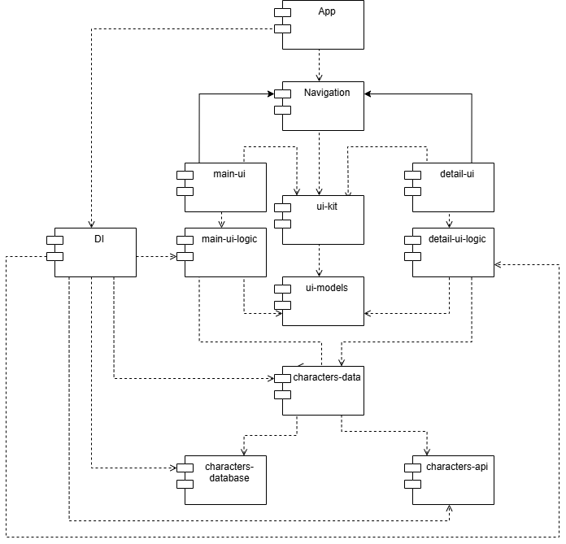
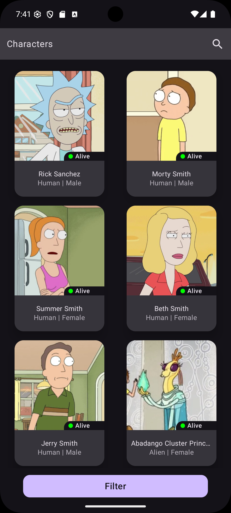
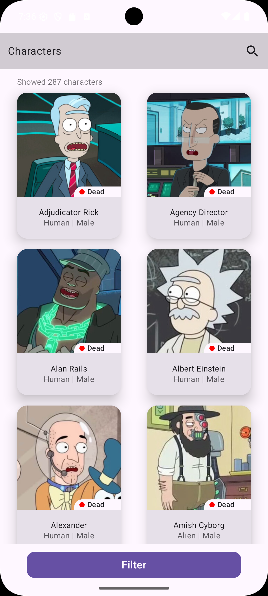

# Workmate

### Технологии

- Kotlin – 2.1.21
- Coroutines – 1.10.1
- Compose(BOM) – 2024.09.00
- Room – 2.7.2
- Retrofit2 – 3.0.0
- Serialization – 2.1.21
- Koin – 4.0.4
- Coil – 2.6.0
- Navigation 3 – 1.0.0-alpha05  
- KSP - 2.1.21-2.0.1

### Структура модулей

### Тема

| **Темная**                                                             | **Светлая**                                                             |
|------------------------------------------------------------------------|-------------------------------------------------------------------------|
| 

 | 

 |